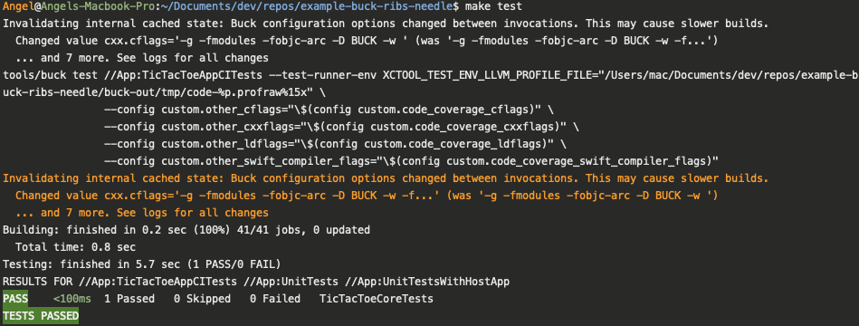
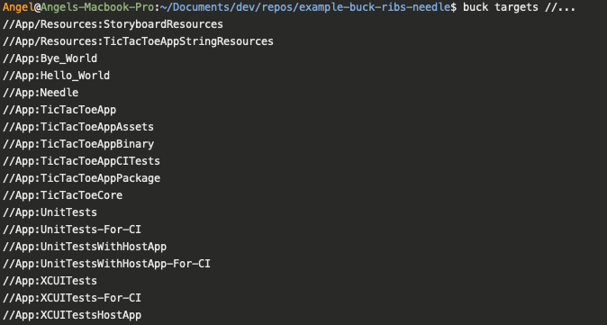
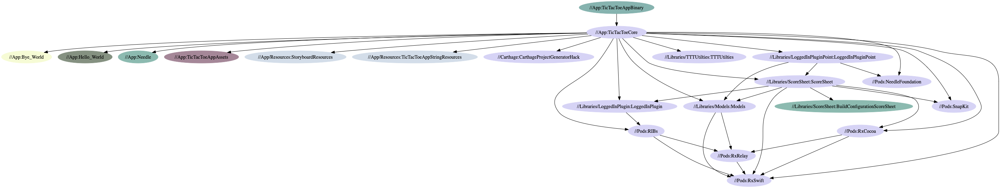

# example-buck-ribs-needle
This repo shows how to build an iOS applications using Buck, RIBs, and Needle. Big thanks to the AirBnB team for their work on [BuckSample](https://github.com/airbnb/BuckSample), without this project, this work wouldn't be possible.

## Documentation
To get started with this project, I'd recommend reviewing the [RIBs documentation](https://github.com/uber/RIBs/wiki) along with this project's [documentation](https://github.com/Angel-Cortez/example-buck-ribs-needle/wiki). This project implements both the [RIBs](https://github.com/uber/RIBs) and [Needle](https://github.com/uber/Needle) frameworks, along with showing an example of a plugin.


### To Install

```sh
# Install Buck
make install_buck
```

Note: you may need to [install Java 8](https://www.oracle.com/technetwork/java/javase/downloads/jdk8-downloads-2133151.html) before `buck` will run for you locally.

### Running Tests
Press `Cmd + U` to run the unit tests for the `TicTacToeApp` target inside Xcode.

Or, from the terminal you can run `make test`.



### Viewing Targets
You may run `make targets` to see a list of Buck targets available to build/test/etc.



### Viewing Dependencies
You may run `buck query "deps(//App:TicTacToeAppBinary)" --dot > result.dot` to save Graphviz output of the dependency tree starting at the rule `//App:TicTacToeAppBinary`. You may then run `dot -Tpng result.dot -o result.png` to create a PNG image showing this dependency structure.



### Generating an Xcode Project
To generate the project from the terminal, just run `make project`. You can then run in the simulator or press `Cmd + U` to run the tests.

You may also use breakpoints, just like normal when using the generated Xcode project.


### CLI

```bash
# generating and opening a Xcode project
make project

# building with Buck CLI
make debug
```

### References
1. [Libraries/LoggedInPluginPoint](Libraries/LoggedInPluginPoint/Sources/Core/LoggedInNonCoreComponent.swift) gives an example how Plugin Point may be designed
1. [AirBnb/BuckSample](https://github.com/airbnb/BuckSample/) the foundational work, which this project is built on
1. [Uber's Plugin Blog Post](https://eng.uber.com/plugins/) "Engineering Scalable, Isolated Mobile Features with Plugins at Uber" - [Brian Attwell](https://github.com/AttwellBrian)
1. [Uber/RIBs](https://github.com/uber/RIBs) • A core framework shown in this project
1. [Uber/Needle](https://github.com/uber/Needle) • A core framework shown in this project
1. https://www.youtube.com/watch?v=8OF7L3SdY5U "Fast reliable Swift builds with Buck" - Robbert van Ginkel
1. https://www.youtube.com/watch?v=uvNI_E0ZgZU "Ludicrously Fast Builds with Buck" - Simon Stewart

Buck Build channel https://buckbuild.slack.com.